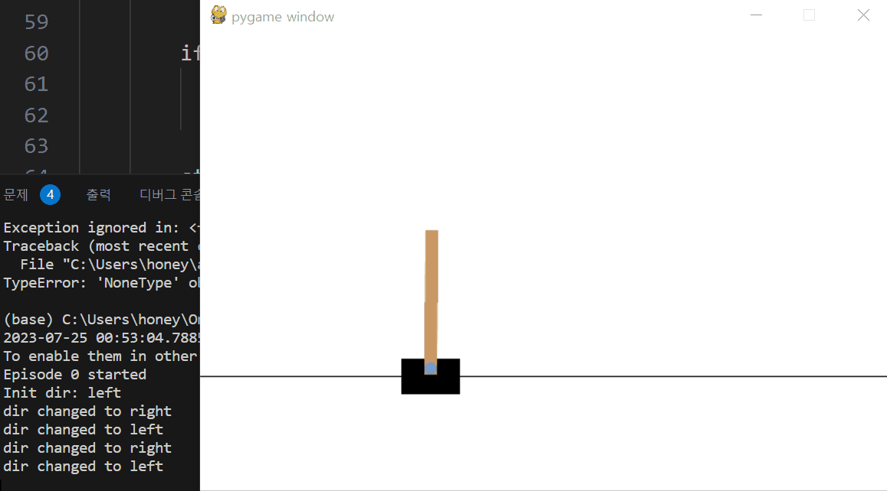

# Moving Cartpole 구현 과정

## 1. Moving Cartpole
Moving Cartpole은 카트를 좌우로 움직여 막대기의 균형을 잡으면서 왼편와 오른편을 번갈아 가면서 도달하는 게임이다. 기존 Cartpole의 문제와 달리 균형을 잡는 것 뿐만 아니라 카트를 움직여 목표 지점에 도달해야 한다. 기존에 Cartpole에 대한 환경을 분석한 적이 있으므로 이것에 대해서는 생략한다.

## 2. 사용자 입력 조종 환경 구현하기
기존 Cartpole의 사용자 입력 조종 환경과 달라진 것이 두 가지가 있는데, 첫 번째로 카트를 왼편으로 옮겨야 비로소 득점 할 수 있게 되어 있다. 그리고 좀 더 자유롭게 움직일 수 있도록 done에서의 각도 제한보다 더 널널하게 설정되었다. 직접 조작해본 결과 막대기의 균형을 잡으면서 카트를 좌우로 움직이는 것은 어렵다.

## 3. DQN으로 학습하는 코드 작성하기

```python
import random
import gymnasium as gym # pip install gymnasium[classic-control]

import numpy as np
import tensorflow as tf 

from keras import Model
from keras.layers import Dense
from keras.optimizers import Adam
from keras.losses import mean_squared_error
```
먼저 문제 해결에 필요한 라이브러리를 import 한다.

```python
class DQN(Model):
    def __init__(self):
        super(DQN, self).__init__()
        self.d1 = Dense(64, input_dim=4, activation='relu')
        self.d2 = Dense(32, activation='relu')
        self.d3 = Dense(32, activation='relu')
        self.d3 = Dense(2, activation='linear')
        self.optimizer = Adam(0.001)

        self.memory = []

    def call(self, x):
        x = self.d1(x)
        x = self.d2(x)
        y_hat = self.d3(x)
        return y_hat
```
늘 먹던 맛. 이번에도 역시 relu와 linear로 구성된 모델을 사용했다.

```python
def update_model(model: DQN, update_last: bool = False):

    if len(model.memory) < 1000:
        return
    
    if len(model.memory) > 10000:
        del model.memory[0]

    sample_size = 32
    batch = random.sample(model.memory, sample_size)
    if update_last:
        batch[-1] = model.memory[-1]

    states, actions, rewards, next_states, dones = zip(*batch)

    states = np.array(states)
    actions = np.array(actions)
    rewards = np.array(rewards)
    next_states = np.array(next_states)
    dones = np.array(dones)

    next_q_value = model.call(next_states).numpy() # type: ignore

    target_y = model.call(states).numpy()  # type: ignore
    target_y[range(sample_size), actions] = rewards + (1 - dones) * 0.95 * np.max(next_q_value, axis=1)  # type: ignore

    with tf.GradientTape() as tape:
        loss = mean_squared_error(target_y, model.call(states))
    grads = tape.gradient(loss, model.trainable_variables)
    model.optimizer.apply_gradients(zip(grads, model.trainable_variables))
```
이번에 update model에 새로운 기능 `update_last`인수를 추가했다. 해당 옵션이 켜지면 함수를 호출하면서 업데이트 할 모델에 마지막 샘플을 추가한다. 꼭 학습해야 할 중요한 샘플이 마지막에 추가되는 경우가 있기 때문에 이런 기능을 추가했다.

```python
model_left = DQN()
model_right = DQN()

model = {
    'left': model_left,
    'right': model_right
}

# 카트폴 게임 환경 생성
env = gym.make('CartPole-v1')
```
사용자 조종 환경에서 카트폴을 연습하면서 왼쪽으로 가는 경우와 오른쪽으로 가는 경우 두 가지를 각각 고려하면 좋겠다고 생각했다. 그래서 왼편과 오른편을 번갈아 가면서 학습시킬 모델을 따로 만들었다.

```python
for episode in range(1000):
    state, info = env.reset()

    dir = np.random.choice(['left', 'right'])
    score = 0
    score_step = []

    for step in range(3000):
        # step 내부에 들어갈 구문...
```

학습하는 구조는 다음과 같다. 매 에피소드를 시작할 때마다 처음 움직이는 방향을 왼쪽을 목표로 할지, 오른쪽으로 할지 결정한다. `score`와 `score_step`은 좌우로 성공적으로 움직였을 때를 관찰하기 위해 만든 변수이다.

```python
action_list = model[dir].call(np.array([state])).numpy()[0]  # type: ignore

# 확률적으로 행동을 선택
action_list = np.exp(action_list) / np.sum(np.exp(action_list))
# action_list -= np.max(action_list)
action = np.random.choice([0, 1], p=action_list)

next_state, reward, _, _, _ = env.step(action)
done = not (-0.3 < next_state[2] < 0.3 and -4 < next_state[0] < 4)

# 각도가 크게 벌어지면 게임 오버
if done:
    reward = -20
    model[dir].memory.append((state, action, reward, next_state, done))
    update_model(model[dir], update_last=True)
    print("Episode: {}, steps: {}, scores: {}, dir: {}, log: {}".format(episode, step, score, dir, score_step))
    break

```
모델에서 추정한 값을 바탕으로 확률적으로 행동을 선택한다. 이 때, `action_list`의 값이 너무 크면 `np.exp()` 함수를 적용하면 overflow가 발생하므로 `np.max()`를 빼주는 것이 좋다. 그리고 각도가 너무 크게 벌어지면 게임 오버로 간주한다.

```python
stable_condition = np.all(abs(np.array(next_state[1:])) < 0.1)

# 카트가 목표 지점에 잘 도달하면 보상
if dir == 'left' and next_state[0] < -1 and stable_condition:
    reward = 50
    model[dir].memory.append((state, action, reward, next_state, done))
    update_model(model[dir], update_last=True)
    dir = 'right'
    score += 1
    score_step.append(step)

elif dir == 'right' and next_state[0] > 1 and stable_condition:
    reward = 50
    model[dir].memory.append((state, action, reward, next_state, done))
    update_model(model[dir], update_last=True)
    dir = 'left'
    score += 1
    score_step.append(step)
```
카트가 목표 지점에 잘 도달하면 보상을 주고, 다음 스텝에서는 반대 방향으로 움직이도록 한다. 왼쪽과 오른쪽 각각 만들어준다. 이 때, 막대기가 너무 크게 흔들리면 방향이 바뀌었을 때 불안정한 상태가 되므로 `stable_condition`을 추가했다.


```python
else:
    # 보상 함수 설계
    if dir == 'left':
        if next_state[0] < -1.1:
            if next_state[0] > state[0]:
                reward = 1
            else:
                reward = -0.5
        else:
            if next_state[0] < state[0]:
                reward = 1
            else:
                reward = -0.5
    else:
        if next_state[0] > 1.1:
            if next_state[0] < state[0]:
                reward = 1
            else:
                reward = -0.5
        else:
            if next_state[0] > state[0]:
                reward = 1
            else:
                reward = -0.5

    model[dir].memory.append((state, action, reward, next_state, done))
    update_model(model[dir])

state = next_state
```
이외의 나머지 작은 보상 함수를 설계했다. 단순히 목표 지점에 가까워질수록 보상을 주고, 멀어지면 약간의 패널티를 주는 방식으로 설계했다.

## 4. 학습 결과
```
Episode: 0, steps: 29, scores: 0, dir: left, log: []
Episode: 1, steps: 75, scores: 0, dir: right, log: []
Episode: 2, steps: 52, scores: 0, dir: left, log: []
Episode: 3, steps: 24, scores: 0, dir: right, log: []
Episode: 4, steps: 15, scores: 0, dir: left, log: []
...
Episode: 525, steps: 178, scores: 0, dir: right, log: []
Episode: 526, steps: 630, scores: 1, dir: right, log: [511]
Episode: 527, steps: 1220, scores: 1, dir: left, log: [147]
Episode: 528, steps: 631, scores: 0, dir: left, log: []
Episode: 529, steps: 25, scores: 0, dir: right, log: []
Episode: 530, steps: 234, scores: 0, dir: left, log: []
Episode: 531, steps: 563, scores: 1, dir: right, log: [419]
Episode: 532, steps: 286, scores: 0, dir: left, log: []
Episode: 533, steps: 201, scores: 1, dir: right, log: [127]
Episode: 534, steps: 362, scores: 1, dir: left, log: [283]
Episode: 535, steps: 358, scores: 1, dir: right, log: [251]
Episode: 536, steps: 577, scores: 0, dir: left, log: []
Episode: 537, steps: 554, scores: 2, dir: right, log: [165, 379]
Episode: 538, steps: 913, scores: 2, dir: left, log: [387, 595]
Episode: 539, steps: 1230, scores: 4, dir: right, log: [221, 607, 821, 1201]
Episode: 540, steps: 436, scores: 2, dir: right, log: [117, 343]
Episode: 541, steps: 598, scores: 3, dir: left, log: [121, 287, 507]
Episode: 542, steps: 362, scores: 1, dir: right, log: [239]
Episode: 543, steps: 47, scores: 0, dir: right, log: []
Episode: 544, steps: 1663, scores: 5, dir: right, log: [275, 555, 803, 1003, 1509]
Episode: 545, steps: 409, scores: 1, dir: right, log: [203]
Episode: 546, steps: 38, scores: 0, dir: left, log: []
Episode: 547, steps: 343, scores: 0, dir: right, log: []
Episode: 548, steps: 857, scores: 2, dir: right, log: [257, 647]
Episode: 549, steps: 265, scores: 0, dir: left, log: []
Episode: 551, steps: 934, scores: 1, dir: left, log: [171]
Episode: 552, steps: 1724, scores: 3, dir: left, log: [307, 1299, 1543]
Episode: 553, steps: 22, scores: 0, dir: right, log: []
Episode: 554, steps: 2683, scores: 5, dir: right, log: [283, 497, 953, 1089, 2443]
```
에피소드 554까지 학습시키는데 55분이 걸렸다. 에피소드 350에 처음으로 방향 전환이 일어났고 그것도 한번 성공할까 말까였다. 에피소드 500을 넘어서야 조금씩 한번 성공하는 비율이 높아졌고 순식간에 좌우로 여러 번 방향을 전환하는 것 까지 잘 되는 비율이 많아졌다. 물론 아직도 실패하는 경우가 많지만, 이전에 비해 훨씬 좋아졌다.

```python
model['left'].save_weights('model_left2', save_format='tf')
model['right'].save_weights('model_right2', save_format='tf')
```
학습이 끝난 모델을 저장한다.

## 5. 인퍼런스
학습을 끝낸 모델을 불러와서 인퍼런스를 진행한다. 그리고 실행 결과를 확인한다.

```python
class DQN(Model):
    pass
    
model_left = DQN()
model_right = DQN()

model_left.load_weights('cartpole2/model_left2')
model_right.load_weights('cartpole2/model_right2')

model = {
    'left': model_left,
    'right': model_right
}

# 카트폴 게임 환경 생성
env = gym.make('CartPole-v1', render_mode="human")

# 인퍼런스
for episode in range(10):
    state, info = env.reset()
    dir = np.random.choice(['left'])
    print("Episode {} started".format(episode))
    print("Init dir: {}".format(dir))

    for step in range(3000):
        action_list = model[dir].call(np.array([state])).numpy()[0]  # type: ignore
        # 확률적으로 행동을 선택
        action = np.argmax(action_list)

        next_state, _, _, _, _ = env.step(action)
        done = not -0.3 < next_state[2] < 0.3

        if done:
            print("Episode {} done after {} steps \n".format(episode, step))
            break

        stable_condition = np.all(abs(np.array(next_state[1:])) < 0.2)

        if dir == 'left' and next_state[0] < -0.8 and stable_condition:
            dir = 'right'
            print("dir changed to right")


        if dir == 'right' and next_state[0] > 0.8 and stable_condition:
            dir = 'left'
            print("dir changed to left")

        state = next_state
```
<br>



실행 결과 막대기의 균형을 잘 잡으면서 카트를 좌우로 움직이는 것을 확인할 수 있다. 가끔씩 가만히 있거나 실패하는 경우도 있다. 여러 경우를 봤을 때 전반적으로 잘 움직이므로 학습이 잘 된 것으로 판단되고 여기서 만족한다.

## 6. 결론
이번 과제를 통해 여러 개의 모델을 만들어 문제를 쪼개서 푸는 방법과, 보상함수를 잘 설계하는 방법에 대해서 잘 알게 되었고, 모델이 추론하는 q-value와 그것을 확률적으로 탐색하게 하는 소프트맥스 기업 등등 또 다른 통찰을 얻을 수 있게 되었다. 이제는 정말로 DQN을 잘 이해하고 있다고 생각한다. 그 생각에 대해 궁금하다면 notion의 공략 가이드를 참고해보자.