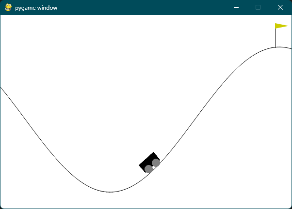

# Mountain Car 구현 과정

## 1. Mountain Car 환경 파악하기
Mountain Car는 카트를 좌우로 움직여 오른쪽 위에 있는 꼭대기에 도달하는 게임이다. 하지만 계속 오른쪽으로 가려고 하면 가파른 경사로 때문에 오히려 더 아래로 내려가게 된다. 따라서 왼쪽으로 가다가 오른쪽으로 가는 등의 행동을 반복해야 한다. Mountain Car의 최종 목표는 가능한 빨리 꼭대기에 도달하는 것이다.

### (1) action space
Discrete(3)으로, 0은 왼쪽으로, 1은 가속하지 않고, 2는 오른쪽으로 이동하는 것을 의미한다.

### (2) observation space
Box(2)로, 카트의 위치와 속도를 나타낸다. 카트의 위치는 -1.2에서 0.6까지, 속도는 -0.07에서 0.07까지의 값을 가진다.

### (3) reward
-1의 reward를 받는다. 즉, 빨리 꼭대기에 도달할수록 더 좋은 결과를 얻을 수 있다.

### (4) terminal state
꼭대기에 도달하면 terminal state가 된다. 또는 truncation으로 200번의 step을 넘어가면 terminal state가 된다.

## 2. 사용자 입력 조종 환경 구현하기
CartPole과 마찬가지로 사용자가 직접 조종할 수 있도록 코드를 작성했다. 다만, CartPole과 달리 Mountain Car는 action space가 3이므로 입력 키를 하나 더 추가했다.
```python
##############################################
# 키보드 입력을 받아 action을 결정하는 코드
from pynput import keyboard  # pip install pynput

action = 0

def left():
    global action
    action = 0

def right():
    global action
    action = 2

def dont_accelerate():
    global action
    action = 1


listener = keyboard.GlobalHotKeys({
    'k': left,  # k는 왼쪽으로 이동
    'l': right,  # l은 오른쪽으로 이동
    'o': dont_accelerate  # o는 가속하지 않음
})

listener.start()
##############################################

import gymnasium as gym
import time

env = gym.make('MountainCar-v0', render_mode="human")
env.reset()
print("READY!")
time.sleep(2)

steps = 0

while True:
    # env.step 진행
    _, _, done, _, _ = env.step(action)

    if done:
        print("steps: {}".format(steps))
        time.sleep(1)
        break

    steps += 1
    time.sleep(0.1)
```


```
READY!
steps: 104
```
직접 조종한 결과 104 step에 걸쳐 꼭대기에 도달했다.

## 3. DQN으로 학습하는 코드 작성하기
코드의 아이디어는 지난 번에 작성한 CartPole 코드와 동일하다.

```python
import random

import gymnasium as gym
import numpy as np

import tensorflow as tf

from keras import Model
from keras.layers import Dense
```
문제 해결에 필요한 라이브러리를 import 한다.

```python
class DQN(Model):
    def __init__(self, state_size, action_size):
        super(DQN, self).__init__()

        self.replay_memory = []

        self.dense1 = Dense(48, activation="tanh", input_dim=state_size)
        self.dense2 = Dense(action_size, activation="softmax")

    def call(self, x):
        x = self.dense1(x)
        return self.dense2(x)
    
    
    def remember(self, state, action, reward, next_state, done):
        self.replay_memory.append((state, action, reward, next_state, done))
```
keras 라이브러리에 있는 `Model` 클래스를 상속하여 DQN 클래스를 만든다. init 함수에 모델의 구조에 대해 정의했고, `remember` 메서드를 통해 리플레이 버퍼에 데이터를 저장할 수 있게 했다.

```python
def update_model(model: DQN):
    # 리플레이 버퍼 크기가 작으면 업데이트하지 않음
    if len(model.replay_memory) < 1000:
        return
    
    # 너무 많으면 리플레이 버퍼 pop
    if len(model.replay_memory) > 20000:
        model.replay_memory.pop(0)

    # 메모리에서 랜덤 샘플링
    samples = random.sample(model.replay_memory, 64)

    # 분할
    states, actions, rewards, next_states, dones = zip(*samples)
    # states, actions, rewards, next_states, dones = zip(*model.replay_memory)

    # numpy 배열로 변환
    states = np.array(states)
    actions = np.array(actions)
    rewards = np.array(rewards)
    next_states = np.array(next_states)
    dones = np.array(dones)

    # 모델 예측
    q_values = model.call(states).numpy()
    next_q_values = model.call(next_states).numpy()

    # 타겟 값 계산
    targets = q_values.copy()
    targets[np.arange(len(rewards)), actions] = rewards + 0.99 * np.max(next_q_values, axis=1) * (1 - dones)

    # 모델 업데이트
    with tf.GradientTape() as tape:
        q_values = model.call(states)
        loss = tf.keras.losses.mean_squared_error(targets, q_values)

    gradients = tape.gradient(loss, model.trainable_variables)
    optimizer = tf.keras.optimizers.Adam(learning_rate=0.001)
    optimizer.apply_gradients(zip(gradients, model.trainable_variables))
```
모델을 업데이트하는 부분이다. `zip()` 함수를 쓰면 기존의 코드보다 훨씬 간결하게 작성할 수 있다.


```python
env = gym.make("MountainCar-v0")
# env = gym.make("MountainCar-v0", render_mode="human")
model = DQN(env.observation_space.shape[0], env.action_space.n)

for episode in range(50):
    state, info = env.reset()
    terminated = False
    truncated = False
    step = 0
    
    max_score = state[0]
    
    while not terminated and step < 1000:

        # 모델로 행동 예측
        q_values = model.call(np.array([state])).numpy()[0]
        
        # 소프트맥스 확률로 행동 선택
        action = np.random.choice(env.action_space.n, p=q_values)

        # 행동 실행
        next_state, reward, terminated, truncated, info = env.step(action)
        max_score = max(max_score, next_state[0])

        if next_state[1] > 0 and action == 2:
            reward = 5
        elif next_state[1] < 0 and action == 0:
            reward = 5
        if terminated:
            reward = 100

        # 리플레이 버퍼에 기억
        model.remember(state, action, reward, next_state, terminated)
        
        # 모델 업데이트
        update_model(model)

        state = next_state
        step += 1
    
    print("Episode: {}, Steps: {}, Max Score: {}".format(episode, step, max_score))

env.close()
model.save_weights('mountaincar2', save_format='tf')
```
학습하는 부분이다. 학습이 종료되는 조건으로 terminated와 truncated가 있는데 truncated의 최대 step 수가 200으로 너무 적어서 1000으로 늘렸다. 또한, `max_score`를 저장하여 학습이 끝난 후에도 얼마나 높은 점수를 받았는지 확인할 수 있게 했다.
그리고 제공된 reward 값을 사용하지 않고 목표치에 빠르게 도달할 수 있도록 reward 함수를 조정했다. 어떻게 그리고 왜 그렇게 했는지에 대해서는 나중에 뒤에서 설명할 것이다.

**코드 실행 결과**

```
Episode: 0, Steps: 1000, Max Score: -0.0765916258096695
Episode: 1, Steps: 1000, Max Score: -0.42932307720184326
Episode: 2, Steps: 824, Max Score: 0.5134018659591675
Episode: 3, Steps: 199, Max Score: 0.5028626918792725
Episode: 4, Steps: 188, Max Score: 0.514388382434845
Episode: 5, Steps: 173, Max Score: 0.5301186442375183
Episode: 6, Steps: 166, Max Score: 0.5196998119354248
Episode: 7, Steps: 153, Max Score: 0.5057381987571716
Episode: 8, Steps: 161, Max Score: 0.5180792808532715
Episode: 9, Steps: 158, Max Score: 0.5051385760307312
Episode: 10, Steps: 164, Max Score: 0.51872718334198
...
Episode: 40, Steps: 153, Max Score: 0.505911111831665
Episode: 41, Steps: 124, Max Score: 0.5024762153625488
Episode: 42, Steps: 102, Max Score: 0.5037283301353455
Episode: 43, Steps: 153, Max Score: 0.5368577837944031
Episode: 44, Steps: 156, Max Score: 0.5368577837944031
Episode: 45, Steps: 87, Max Score: 0.5023248195648193
Episode: 46, Steps: 88, Max Score: 0.5035244822502136
Episode: 47, Steps: 156, Max Score: 0.505911111831665
Episode: 48, Steps: 105, Max Score: 0.5099307298660278
Episode: 49, Steps: 157, Max Score: 0.5368577837944031
```
처음에는 최대 스텝 수에 도달할 만큼 학습이 잘 이루어지지 않았으나 몇 개의 episode가 지난 후에는 1000 스텝을 모두 소모하지 않고도 목표치에 도달하는 것을 확인할 수 있다. 이후에는 평균적으로 150, 최소 80 스텝 내에 목표치에 도달하는 것을 확인할 수 있다.

## 4. 인퍼런스

항상 최고의 q값을 가지는 action을 선택하게 하면 된다.
```python
import numpy as np

from keras.models import Sequential
from keras.layers import Dense
from keras.optimizers import Adam
from keras import Model

import tensorflow as tf

import gymnasium as gym

class DQN(Model):
    def __init__(self, state_size, action_size):
        super(DQN, self).__init__()

        self.replay_memory = []

        self.dense1 = Dense(48, activation="tanh", input_dim=state_size)
        self.dense2 = Dense(action_size, activation="softmax")

    def call(self, x):
        x = self.dense1(x)
        return self.dense2(x)
    
    
    def remember(self, state, action, reward, next_state, done):
        self.replay_memory.append((state, action, reward, next_state, done))

env = gym.make('MountainCar-v0', render_mode="human")

model = DQN(env.observation_space.shape[0], env.action_space.n)
model.load_weights("mountaincar2")  # 경로 항상 유의 (경로 기준은 터미널)

state, info = env.reset()

while True:
    state, info = env.reset()

    for step in range(1000):
        action_list = model.call(np.array([state])).numpy()[0]
        action = np.argmax(action_list)

        state, _, done, _, _ = env.step(action)

        if done:
            print("Episode finished after {} timesteps".format(step+1))
            break
```
**실행 결과**
```
Episode finished after 159 timesteps
Episode finished after 152 timesteps
Episode finished after 157 timesteps
Episode finished after 164 timesteps
Episode finished after 89 timesteps
```
코드 실행 결과 잘 동작하는 것을 확인할 수 있다.

## 5. 학습하는 코드를 작성했을 때 생긴 고민거리

**reward 함수 설계**

처음에 Cartpole처럼 코드 구조를 다 설계하고 나서 실행해봤더니 학습이 잘 되지 않았는데, 이것을 살펴보니 목표 지점에 도달하는 경험은 커녕 action은 계속 좌우(그리고 가속 없음)로 번갈아 선택이 되면서 가장 낮은 위치에서 벗어나지 못하고 있다. 그런 과정에서 reward 값이 계속 -1만 들어가게 되면 모델은 어떤 상황인지 알 수 없으니 학습이 잘 안될 것이다.
그렇기에 reward 함수를 재설정하는 것이 필요했다.

```python
if terminated:
    reward = 100
```
일단은 목표 지점에 도달하면 큰 보상을 주기로 했다. 하지만 이전과 같이 action이 좌우로 빠르게 번갈아 가면서 선택이 되기에 우연히라도 목표에 도달하는 모습을 볼 수가 없었고, 목표에 도달한 경험이 없기 때문에 여전히 학습이 되지 않았다.

```python
if next_state[1] > 0 and action == 2:
    reward = 5
elif next_state[1] < 0 and action == 0:
    reward = 5
if terminated:
    reward = 100
```
현재 카트의 속도와 action을 비교하여 그것이 일치하면 약간의 보상을 주기로 했고, 목표 지점에 도달하면 큰 보상을 주기로 했다. 그 결과 학습이 잘 되었다. 그런데 state와 reward를 직접 건드려서 학습을 할 것이면 결국에는 일반적인 알고리즘을 작성해도 되는 것이 아닌가 하는 생각이 들었다. 그래서 조금 더 강화학습적인 reward 함수를 만들어보고 싶었다.

```python
reward = next_state[0] - state[0]
if terminated:
    reward = 100
```
그래서 위와 같이 reward 함수를 다시 작성해보았다. 이것은 카트의 위치가 이전보다 더 앞으로 갔다면 보상을 주는 것이다. 그런데 이것은 학습이 잘 되지 않았다. 실제로 action이 선택되는 패턴을 보면 0, 1, 2가 그저 무작위로 선택될 뿐이였고 이는 학습이 되지 않는 것을 볼 수 있다. 이외에도 여러가지 다양한 시도를 해봤으나, 배운 개념만으로는 해결하기 힘들 것 같다. 

## 6. 결론
강화학습을 수행함에 있어서 reward 함수를 어떻게 설계하는지, 그리고 인공신경망 모델이 reward 함수를 어떻게 읽어들일 수 있을지 고민을 많이 하게 되었다.