# Inverted Pendulum 구현 과정

## 1. Inverted Pendulum 환경 파악하기
Inverted Pendulum은 한쪽에 고정된 막대를 회전시켜 막대기를 세우는 게임이다. 회전력에 한계가 있기 때문에 막대기가 넘어지지 않도록 잘 조절해야 한다. Inverted Pendulum의 최종 목표는 막대기를 안정적으로 세우는 것이다.

### (1) action space
-2에서 2까지의 실수형 자료형 하나로 양수면 반시계 방향으로, 음수면 시계 방향으로 회전력을 가한다.

### (2) observation space
observation space는 3개의 실수형 자료형으로 구성되어 있다.

- -1에서 1까지의 실수형 자료형으로 막대기의 x좌표를 나타낸다. x좌표는 고정되어 있지 않은 부분의 높이로, 1로 세우는 것이 목표가 된다.
- -1에서 1까지의 실수형 자료형으로 막대기의 y좌표를 나타낸다. y좌표는 고정되어 있지 않은 부분의 위치로, 음수면 오른편에 있고 양수면 왼편에 있다.
- -8에서 8까지의 실수형 자료형으로 막대기의 각속도를 나타낸다. 시계 방향으로 회전하면 음수, 반시계 방향으로 회전하면 양수이다.

그리고 $\theta$가 있는데 이는 막대기의 각도를 나타낸다. 

### (3) reward
보상 함수는 아래 수식과 같이 각도, 각속도, 그리고 회전력을 통해 계산된다. 거꾸로 잘 세워질수록, 각속도가 낮을수록 그리고 가해지는 회전력이 약할 수록 좋은 보상을 받을 수 있다. 가장 좋을 때 보상은 0이다.
$$
r = -\theta^2 - 0.1\dot{\theta}^2 - 0.001\tau^2
$$
<br>

## 2. 사용자 입력 조종 환경 구현하기
제공되어 있는 코드를 이용하여 구현한다. 처음에는 조종 및 제어하는 것이 어려운데, 하다보면 거꾸로 잘 세울수가 있었다.

<details>
<summary>코드 보기</summary>
<div markdown="1">

```python
##############################################
# 키보드 입력을 받아 action을 결정하는 코드
from pynput import keyboard  # pip install pynput

action = 0

def left():
    global action
    action = -2

def right():
    global action
    action = 2

def dont_accelerate():
    global action
    action = 0


listener = keyboard.GlobalHotKeys({
    'j': left,  # j는 시계 방향으로 가속
    'l': right,  # l은 반시계 방향으로 가속 
    'k': dont_accelerate  # k는 가속하지 않음
})

listener.start()
##############################################

import gymnasium as gym
import time

env = gym.make('Pendulum-v1', render_mode="human")
env.reset()
steps = 0

while True:
    # env.step 진행
    _, reward, done, _, _ = env.step((action,))

    print("현재", steps, "스텝 에서의 보상 반환값:", reward)

    steps += 1
    time.sleep(0.1)
```

</div>
</details>
<br>

## 3. DQN으로 학습하는 코드 작성하기
### 3-1. action 이산화
우리가 배운 DQN 모델에서 action은 discrete하지만, 해당 문제에서 action은 continuous하다. 따라서 이 문제를 해결하기 위해 action을 이산화하는 방법을 선택했다. action의 입력 범위는 -2에서 2이므로 이것을 0.5 간격으로 쪼개서 총 9개의 action으로 만들었다. 이렇게 하면 action의 개수가 9개로 줄어들고, 이를 이용하여 DQN 모델을 학습시킬 수 있게 된다.

<br>

### 3-2. DQN 모델 구현
먼저 DQN 모델이다. 이번에는 relu 활성화 함수를 사용하는 모델을 여러 layer 만들었다. 마지막 출력단 층에서는 확률의 결정 정도를 결정짓기 위해 softmax 함수를 이용했다. relu가 만드는 비선형함수를 만들어보기 위해 hidden layer들은 relu로 결정했다.

<details>
<summary>코드 보기</summary>
<div markdown="1">

```python
class DQN(Model):
    def __init__(self, state_size, action_size):
        super(DQN, self).__init__()

        self.replay_memory = []

        self.dense1 = Dense(128, activation="relu", input_dim=state_size)
        self.dense2 = Dense(128, activation="relu")
        self.dense3 = Dense(64, activation="relu")
        self.dense4 = Dense(32, activation="relu")
        self.dense5 = Dense(action_size, activation="softmax")

        self.optimizer = tf.keras.optimizers.Adam(learning_rate=0.001)

    def call(self, x):
        x = self.dense1(x)
        x = self.dense2(x)
        x = self.dense3(x)
        x = self.dense4(x)
        x = self.dense5(x)

        return x
    
    def remember(self, state, action, reward, next_state):
        self.replay_memory.append((state, action, reward, next_state))
```

</div>
</details>
<br>

### 3-3. 모델 업데이트 함수 구현
모델 업데이트 함수는 mountain car에서 사용했던 코드를 가져와서 적용시켰다. 달라진 점이라면 `done`이 필요없어서 제거했다.

<details>
<summary>코드 보기</summary>
<div markdown="1">

```python
def update_model(model: DQN):
    # 리플레이 버퍼 크기가 작으면 업데이트하지 않음
    if len(model.replay_memory) < 1000:
        return
    
    # 너무 많으면 리플레이 버퍼 pop
    if len(model.replay_memory) > 30000:
        del model.replay_memory[0]

    # # 메모리에서 랜덤 샘플링
    sample_size = 500
    samples = random.sample(model.replay_memory, sample_size)

    # 분할
    states, actions, rewards, next_states = zip(*samples)

    # numpy 배열로 변환
    states = np.array(states)
    actions = np.array(actions)
    rewards = np.array(rewards)
    next_states = np.array(next_states)
    
    # 모델 예측과 타겟 값 계산
    targets = model.call(states).numpy()  # type: ignore
    next_q_values = model.call(next_states).numpy() # type: ignore

    targets[np.arange(len(samples)), actions] = rewards + 0.99 * np.max(next_q_values, axis=1)

    # 모델 업데이트
    with tf.GradientTape() as tape:
        q_values = model.call(states)
        loss = tf.keras.losses.mean_squared_error(targets, q_values)

    gradients = tape.gradient(loss, model.trainable_variables)
    model.optimizer.apply_gradients(zip(gradients, model.trainable_variables))
```

</div>
</details>
<br>


### 3-4. 학습 코드 구현
학습 코드에서는 10개의 에피소드마다 모델이 어떻게 동작하는지 보기 위해 `gym.make`코드를 추가적으로 넣었다. 매 에피소드는 500스텝이 넘으면 종료하게 설계했다. `env.step`에 들어가는 수는 action의 인덱스를 실질적인 action의 수로 바꿀 수 있도록 설계했다. 그리고 reward 함수가 많은 우여곡절이 있었는데, 이것은 나중에 설명할 수 있도록 한다. 중력가속도는 10으로 설정했다. (중력가속도 5와 10은 큰 차이가 없다.)

<details>
<summary>코드 보기</summary>
<div markdown="1">

```python
gravity = 10
# env = gym.make("Pendulum-v1", g=9.81, render_mode="human")
env = gym.make("Pendulum-v1", g=gravity, render_mode="human")
model = DQN(3, 9)
model.load_weights("model_final")

for episode in range(50):
    if episode % 10 == 0:
        env = gym.make("Pendulum-v1", g=gravity, render_mode="human")
    else:
        env = gym.make("Pendulum-v1", g=gravity)
    state, info = env.reset()
    terminated = False
    truncated = False
    step = 0

    rewards = []

    nice_state = False

    while not terminated and step < 500:

        # 모델로 행동 예측
        action = model.call(np.array([state])).numpy()[0]  # type: ignore
        action = np.random.choice(9, p=action)

        # 행동 실행
        next_state, reward, terminated, truncated, info = env.step((action/2-2,))

        if next_state[0] > 0.985 and abs(next_state[2]) < 0.2:
            nice_state = True
            reward += 50
        elif nice_state:
            nice_state = False
            reward -= 100

        if next_state[0] > 0.9:
            if next_state[0] < state[0]:
                if next_state[1] > 0:
                    if next_state[2] > state[2]:
                        reward -= 20
                    else:
                        reward += 10
                else:
                    if next_state[2] < state[2]:
                        reward -= 20
                    else:
                        reward += 10
            else:
                reward += 5
        
        elif next_state[0] < 0:
            if next_state[1] > 0 and next_state[2] > 0:
                if action > 4:
                    reward += 2
            elif next_state[1] < 0 and next_state[2] < 0:
                if action < 4:
                    reward += 2
        
        # 리플레이 버퍼에 기억
        model.remember(state, action, reward, next_state)
        
        # 모델 업데이트
        # if step % 50 == 0:
        update_model(model)

        state = next_state
        step += 1

        rewards.append(reward)

    if episode % 5 == 0:
        draw_qvalue(model, episode)
    
    print("Episode: {}, Steps: {}, Score: {:.2f}, Last Score: {:.2f}".format(episode, step, sum(rewards) / len(rewards), sum(rewards[-10:])/10))

env.close()
```

</div>
</details>
<br>


### 3-5. 데이터 시각화
데이터를 보다 더 잘 분석하기 위해 모든 state에 대해 각 action마다 어떤 선택을 나타내는지 확인하기 위해 만들었다. 이렇게 하면 학습의 정도를 파악하고 학습 경과시간에 따라 현재 모델이 수렴하는지 발산하는지에 대해 확인을 할 수 있다. 각각의 그래프는 action에 대한 확률 선택 정도이고 밝으면 밝을수록 해당 state에 대해 그 action을 선택할 확률이 높다는 것을 의미한다. 가로축은 막대기의 각속도고 세로축은 막대기의 각을 의미한다. $\theta$가 0이면 현재 거꾸로 잘 서있는 형태이고 3.1 또는 -3.1 부근이면 막대가 아래로 떨어지는 형태이다.

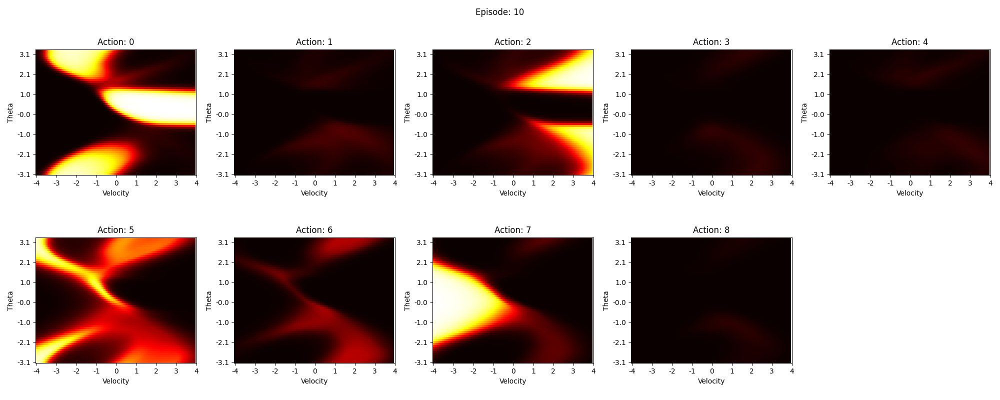

<details>
<summary>코드 보기</summary>
<div markdown="1">

```python
import os    
import matplotlib.pyplot as plt

os.environ['KMP_DUPLICATE_LIB_OK'] = 'True'

def draw_qvalue(model, episode):
    thetas = np.arange(-np.pi, np.pi, 0.1)
    velocities = np.arange(-4, 4, 0.1)

    states = np.array([[np.cos(theta), np.sin(theta), velocity] for theta in thetas for velocity in velocities])
    z = model.call(states).numpy()
    z_np = np.array(z).reshape((len(thetas), len(velocities), 9))

    fig, ax = plt.subplots(2, 5, figsize=(20, 8))
    fig.suptitle("Episode: {}".format(episode))
    for i in range(9):
        ax[i//5][i%5].title.set_text("Action: {}".format(i))
        ax[i//5][i%5].imshow(z_np[:,:,i], cmap='hot', interpolation='nearest', clim=(0, 1))
        ax[i//5][i%5].set_xticks(np.arange(0, 81, 10))
        ax[i//5][i%5].set_yticks(np.arange(0, 64, 10))
        ax[i//5][i%5].set_xticklabels(np.arange(-4, 5, 1))
        ax[i//5][i%5].set_yticklabels(np.round(np.arange(-np.pi, np.pi+0.1, 2*np.pi/6),1))
        ax[i//5][i%5].set_xlabel("Velocity")
        ax[i//5][i%5].set_ylabel("Theta")
        ax[i//5][i%5].invert_yaxis()  # y축 변경
    ax[1][4].axis('off')  # 마지막 subplot은 빈 공간

    plt.tight_layout()
    plt.savefig("model8_image/episode_{}.png".format(episode))
```

</div>
</details>
<br>

### 3-6. 실행 결과
에피소드는 50번 실행했다. 학습하는데 30분 정도 소요되었다. 성공할 때도 있고, 실패할 때도 있지만 에피소드가 증가하면 증가할수록 거꾸로 세우는 확률이 높다. 실패 요인으로서는 완전히 정지 상태일 때 action을 하지 않는 모습을 보이고 잘 세운 막대기가 떨어지는 경우는 없는 것 같다. 아마 수렴을 덜 한 것 같다.

```
EEpisode: 0, Steps: 500, Score: -5.27, Last Score: -4.74
Episode: 1, Steps: 500, Score: -6.80, Last Score: -7.74
Episode: 2, Steps: 500, Score: -7.37, Last Score: -7.60
Episode: 3, Steps: 500, Score: -7.01, Last Score: -8.29
Episode: 4, Steps: 500, Score: -5.29, Last Score: -7.81
Episode: 5, Steps: 500, Score: -5.85, Last Score: -6.89
Episode: 6, Steps: 500, Score: -5.18, Last Score: -4.11
Episode: 7, Steps: 500, Score: -6.37, Last Score: -5.37
...
Episode: 42, Steps: 500, Score: -6.51, Last Score: -7.04
Episode: 43, Steps: 500, Score: 33.19, Last Score: 42.49
Episode: 44, Steps: 500, Score: -5.00, Last Score: -3.51
Episode: 45, Steps: 500, Score: 38.50, Last Score: 37.48
Episode: 46, Steps: 500, Score: 45.51, Last Score: 52.99
Episode: 47, Steps: 500, Score: 42.87, Last Score: 55.00
Episode: 48, Steps: 500, Score: -4.81, Last Score: -6.10
Episode: 49, Steps: 500, Score: -5.01, Last Score: -5.04
Episode: 50, Steps: 500, Score: 23.11, Last Score: 42.50
```
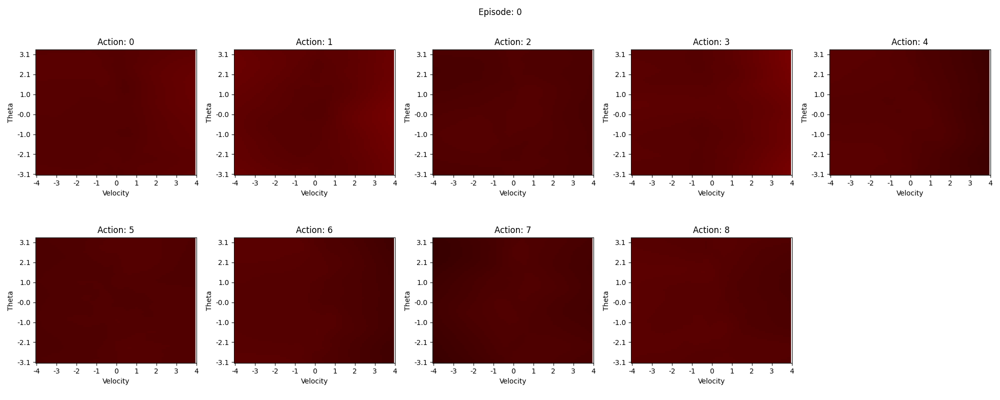
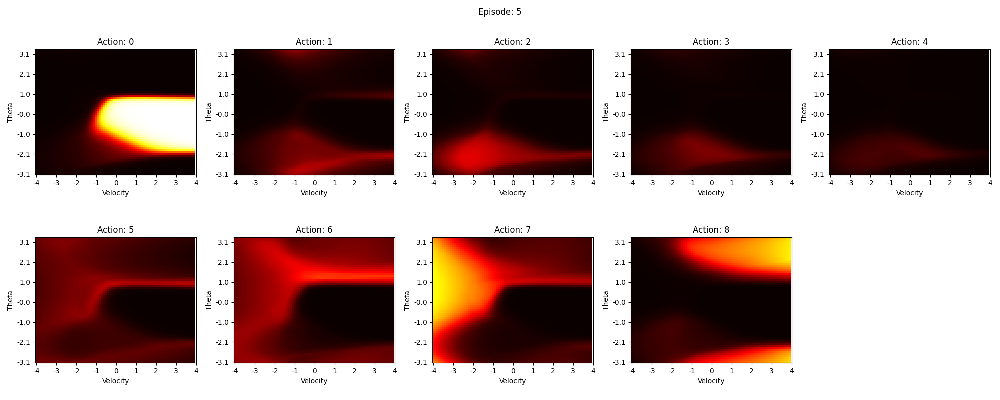

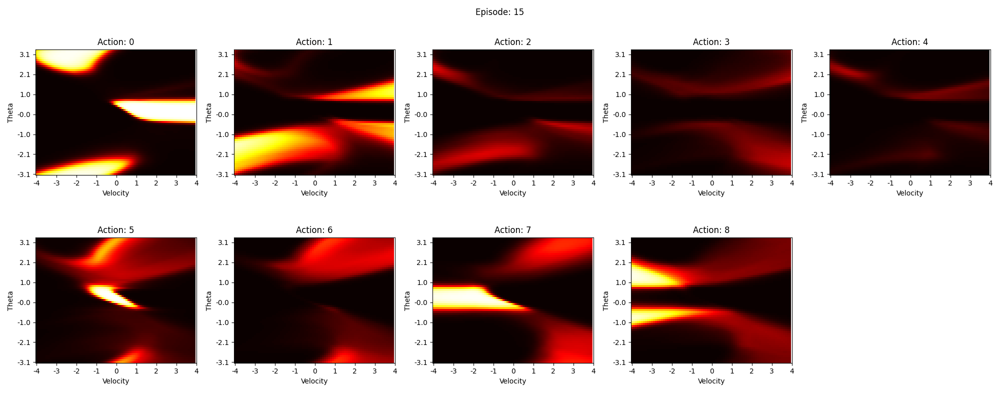
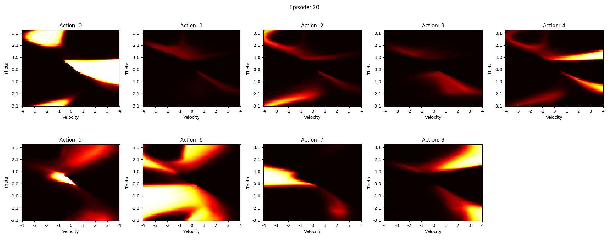
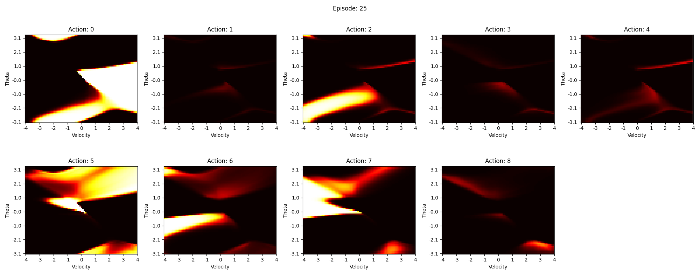
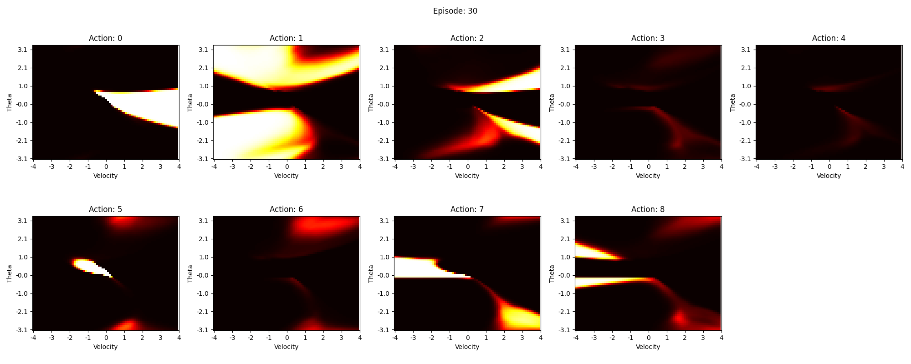
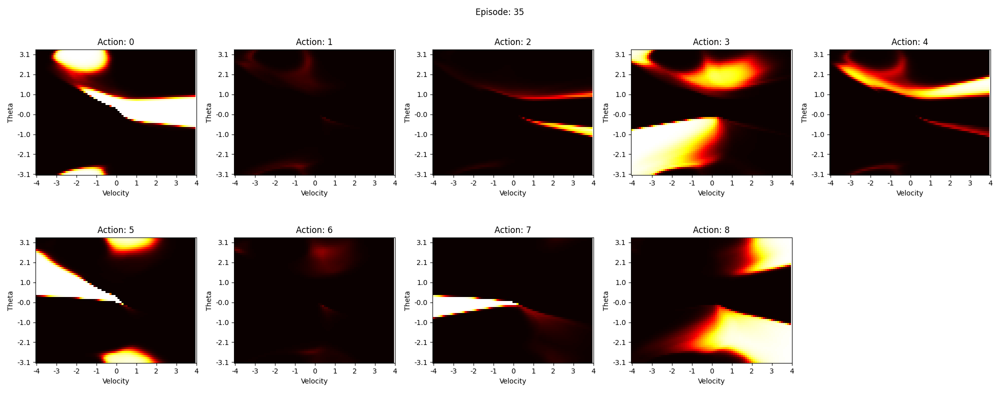
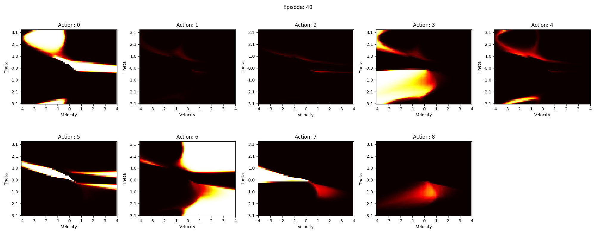
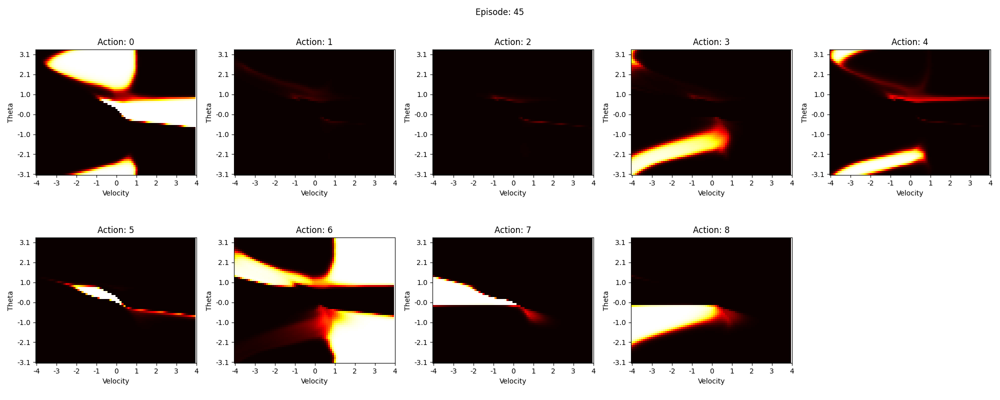
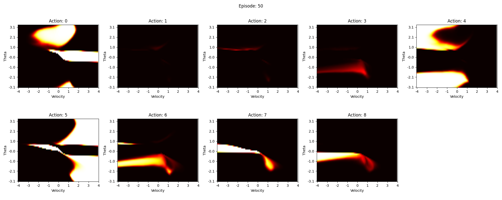

### 3-7. 모델 저장 및 인퍼런스
모델을 저장하고 인퍼런스를 실행하여 학습할 때와 같이 잘 실행이 될 때도 있었지만, 가끔 swing을 하지 않는 잘못된 action을 하는 경우도 존재했다.

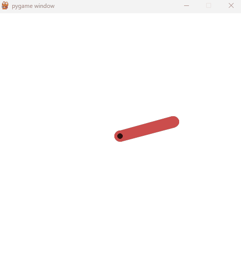

## 4. 우여곡절

### 4-1. DQN과 continuous한 action
해보면 알겠지만, continuous한 action의 경우 target_y를 정의하는 부분에서 문제가 발생한다. 이는 continuous한 action을 discrete한 action으로 바꾸어서 해결할 수 있다. 이를 위해 action을 9개로 나누어서 해결하였다.

### 4-2. 보상 함수 설계
기본으로 주어져 있는 보상 함수가 있지만, DQN 모델에서는 잘 학습이 되지 않는 것 같다. 그래서 기존 보상 함수에 특별 보상을 추가하였다. 특별 보상은 다음과 같이 설계하였다.
* 막대기가 세워져 있고 균형을 유지하면 +50의 reward
* 균형을 잘 유지하고 있다가 막대기가 넘어지면 -100의 reward
* 막대기가 거의 세웠을 때 (x좌표가 0.9 이상)
  * 높이가 증가하면 +5의 리워드
  * 높이가 낮아지고 있을 때
    * 중심 방향에 맞게 가속되면 +10의 reward
    * 떨어지는 방향으로 가속하면 -20의 reward
* 막대기가 바닥에 있을 때
  * 중심 방향에 맞게 가속되면 +2의 reward

```python
if next_state[0] > 0.985 and abs(next_state[2]) < 0.2:
    nice_state = True
    reward += 50
elif nice_state:
    nice_state = False
    reward -= 100

if next_state[0] > 0.9:
    if next_state[0] < state[0]:
        if next_state[1] > 0:
            if next_state[2] > state[2]:
                reward -= 20
            else:
                reward += 10
        else:
            if next_state[2] < state[2]:
                reward -= 20
            else:
                reward += 10
    else:
        reward += 5

elif next_state[0] < 0:
    if next_state[1] > 0 and next_state[2] > 0:
        if action > 4:
            reward += 2
    elif next_state[1] < 0 and next_state[2] < 0:
        if action < 4:
            reward += 2
```

물론 여러 차례의 다른 방법으로도 시도를 해봤고 이렇게 복잡하게 하지 않아도 어느정도 목표치에 잘 도달할 수 있었다. 막대기에 잘 올릴 수 있도록 보상함수를 설계하려면 state가 어떻게 변화하면서 목표치에 달성해야 되는지 고민하면서 reward 함수를 설계하면 된다. 

## 5. 결론
이번에 데이터 시각화까지 수행하면서 DQN에서 사용되는 인공신경망과 업데이트 하는 방식 및 전체적인 흐름을 잘 이해할 수 있었다.